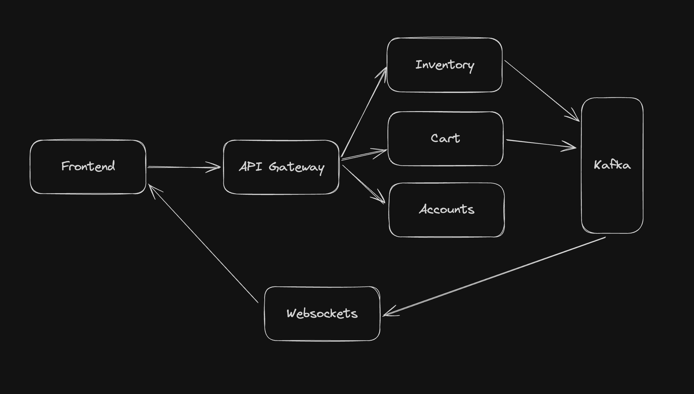

# Products Monorepo
This is a E Commerce web application build to demostrate event based architecture

## Quick Start
To start the web app
### Step 1:
Install and Start Docker

### Step 2:
```bash
make up
```
Application runs in http://localhost:3000

---

### Server Details
#### Frontend
Main App - http://localhost:3000
#### Backend
API Gateway - http://localhost:4000 \
Websockets - http://localhost:5001 or `ws://localhost:5001`

#### Service Map
| Service       | Host                       | Gateway URL                         |
|---------------|----------------------------|-------------------------------------|
| Inventory     | http://localhost:4001      | http://localhost:4000/inventory     |
| Orders        | http://localhost:4002      | http://localhost:4000/orders        |
| Cart          | http://localhost:4003      | http://localhost:4000/cart          |
| Notifications | http://localhost:4004      | http://localhost:4000/notifications |
| Payments      | http://localhost:4005      | http://localhost:4000/payments      |
| Accounts      | http://localhost:4006      | http://localhost:4000/accounts      |


## Service Info

**Accounts Service** - A service that stores user and their authentication info

**Inventory Service** - A service that keeps all product inventory and keep track of it's availability, pricing and categorizing them

**Cart Service** - A service that handles user cart like what items are in it, adding, deleting. Metrics like tax, subtotal, total.

**API Gateway** - Entrypoint to all microservices, /MICROSERVICE_NAME will redirect to respective microservice. this helps avoid too many environment or config variables for domains

**Websockets** - Provide real time updates to browser for all active tabs. (Planning to make this part of api gateway instead of calling it directly)

**Kafka** - Powering event based architecture, handles all events being produced and consumed by microservices

## How they work with each other

Frontend makes api calls to inventory service to load all products on home page and to cart service to get what items are in the cart.

Inventory service wants to know how many users added a products in to cart for all the products it returns. So that frontend displays a badge like "2 others added to cart" for a product.

Cart service produces an event called `update_metrics` to a topic `cart` that will provide user count everytime someone adds, remove or update an item in cart.

Inventory service listens to topic `cart` and to the event(`update_metrics`) and it updates the user count in db from event data

But user has to refresh the page to see the updated count of "users added to cart".

To have real time updates for an open tab, eebsockets service listens to same topic `cart` and to event `update_metrics` and publishes event with user count to browser that has that product displaying.


## Coming Soon

Orders, Payments, Notifications are coming soon

##


